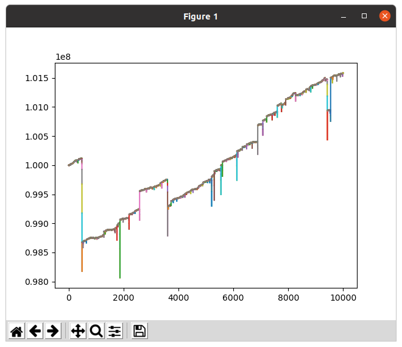

# Game - Governor of Poker 3 Blackjack simulator

## Description

Did you ever think that blackjack was a way to make money over the long term? On  **Governor of Poker 3** (GOP3) it's possible to make some.

Blackjack from GOP3 is simulated by this project by playing a *perfect AI* that follows the rules of this [**table**](https://www.blackjackapprenticeship.com/blackjack-strategy-charts/) and bets available bets in **GOP3** following a [**Martingale betting system**](https://en.wikipedia.org/wiki/Martingale_(betting_system)).



Here is the evolution of the player's money on 10.000 games.

## Prerequisites

To run this project you need to install **matplotlib** python library if you want to draw graphs to see the evolution of the player's balance:

```sh
apt-get install python3-matplotlib
```

## Run the project

To run the project just go in *script/* directory and run the shell script file like so:

```sh
cd script/
./run.sh file_name
```

This script runs the Blackjack game, saves the evolution of the player's balance in *output/file_name* and draws a graph as a result.

To only run the Blackjack game you can do:

```sh
cd Game-GOP3BlackJackSimulator/
make re && ./bin/bj file_name
```

To only draw a balance evolution graph you can type:

```sh
cd Game-GOP3BlackJackSimulator/
python3 python/graph.py output/file_name
```

## Project MACROS
You can modify some MACROS in the code to fit with other Blackjack rules:

```C
[include/deck.h]
    #define NB_DECK_S   6

[include/game.h]
    #define NB_GAME             10000
    #define DEALER_THRESHOLD    16
```

You can set the initial player's balance here:

```C
[src/main.c]
    player.balance = 100000000;
```

## Code your own algorithm
You can code your own algorithm by deleting all files located in *include/algo* and *src/algo* folders and by implementing your own functions with these signatures:

```C
void    bet(player_s* player, uint8_t idx);
void    player_turn(deck_s* deck, player_s* player, dealer_s* dealer);
```

Make sure to uncomment these lines when developing your own algorithm:
```C
[include/print.h]
    #define SHOW_PRINT
    #define SHOW_ERROR
```
It will help to debug.
